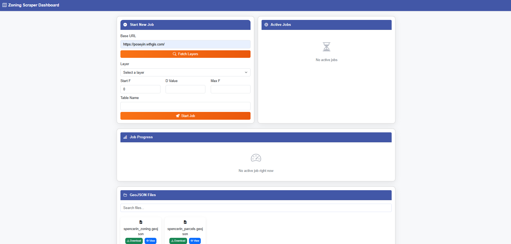
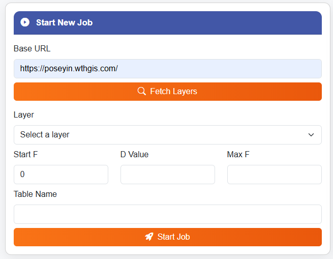
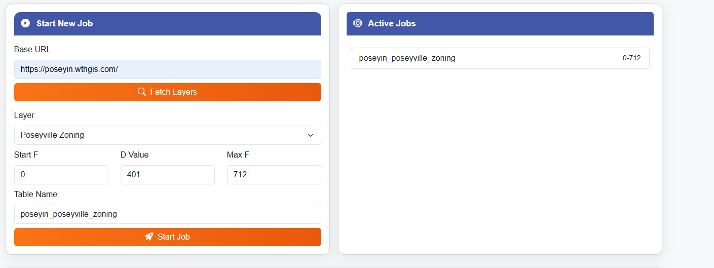
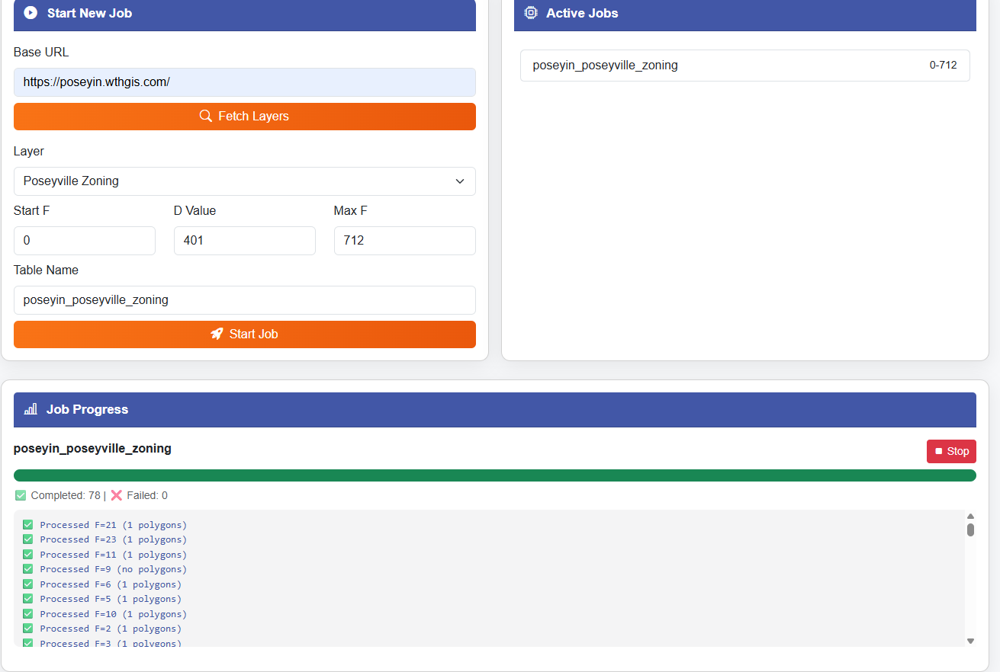
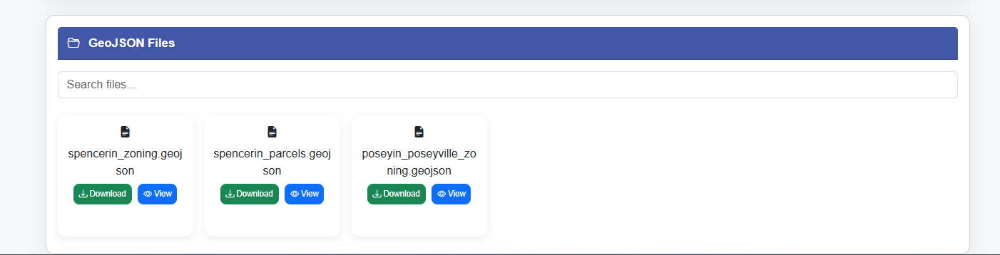
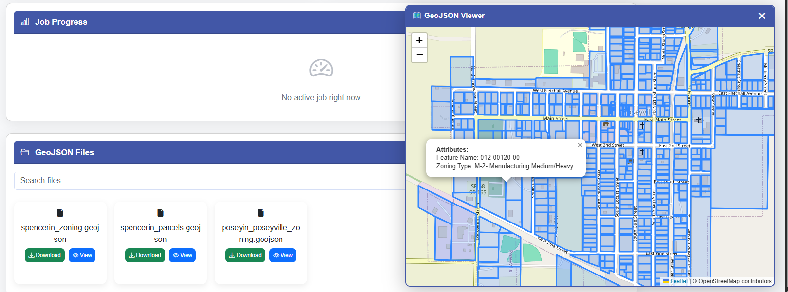

# 🗺️ ThinkGIS Scraper

An automated **WTHGIS / ThinkGIS zoning layer scraper** with a modern web interface, multi-job execution, live logs, and GeoJSON export & map preview.

This tool allows users to enter any supported ThinkGIS/WTHGIS county URL and automatically:  
✅ Detect zoning layers  
✅ Build scraping jobs  
✅ Scrape geometry + attributes using internal JS endpoints  
✅ Monitor scraping progress live  
✅ Download or preview GeoJSON data directly in the browser

---

## 🚀 Features

### 🌐 Clean Frontend Dashboard

A beautifully designed interface showing the main dashboard where users can manage scraping tasks and files.

---

### 📌 Layer Detection

Once the user enters the county website URL, the system automatically discovers all available zoning layers and displays them as selectable options.

---

### ⚙️ Run Multiple Jobs Concurrently

The platform supports **multiple scraping jobs at the same time**.  
Each job runs independently using a background worker.

---

### 📡 Live Job Progress

Users can monitor real-time progress such as:  
- Current feature being scraped  
- Max F value  
- Requests completed  
- Errors & retries  
- Job status (Running / Completed)

---

### 📁 GeoJSON Management

A list of all generated GeoJSON files with simple options to:  
- ✅ Download  
- ✅ Preview on map  

---

### 🗺️ Map Viewer

Clicking **View** opens a dynamic map showing:  
- Zoning polygons  
- Geometry boundaries  
- Attribute popup on click  
- Color-coded layers  

Perfect for validating your scraping results instantly.

---

## 🏗️ How It Works (Technical Overview)

1. User enters **WTHGIS/ThinkGIS** base URL  
2. System fetches the **index** endpoint  
3. Extracts zoning layers + IDs  
4. Builds scraping URLs using county JS logic  
5. Finds **D** and **MaxF** values  
6. Loops from `F = 0 → MaxF` to scrape:  
   - Geometry  
   - Properties  
   - Metadata  
7. Each layer is stored as **GeoJSON**  
8. User can view, download, or reprocess anytime

---

## ✅ Stack Used

- **Python** (Flask backend)  
- **WebSockets** for real-time logs  
- **Background worker** for parallel jobs  
- **HTML/CSS/JS frontend** (lightweight, responsive)  
- **Leaflet.js** for GeoJSON map visualization

---

## 📂 Output

All results are saved as:
--
/exports/County_name/layer_name.geojson , and accessible through the UI.

---

## 📌 Roadmap

- ✅ Multi-job parallel execution  
- ✅ Live job updates  
- ✅ GeoJSON preview  
- 🔜 Export metadata report  
- 🔜 Auto-retry failed feature scraping  
- 🔜 REST API for automation  

---
